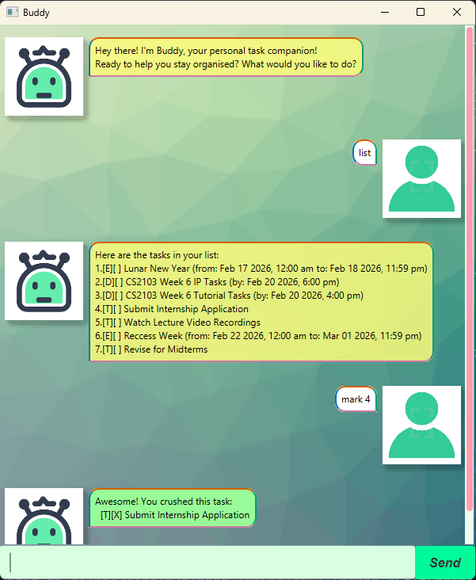

# Buddy User Guide



Buddy is your friendly personal task companion that helps you stay organised! Whether you need to track simple to-dos, deadlines, or events, Buddy has got you covered with an intuitive chat interface.

## Quick Start

1. Download the latest `buddy.jar` from the releases page
2. Double-click the jar file to launch Buddy
3. Start typing commands in the input box at the bottom
4. Press Enter or click Send to execute commands

## Features

### Adding a Todo Task: `todo`

Add a simple task without any date/time.

**Format:** `todo DESCRIPTION [/tag TAG]`

**Examples:**
- `todo buy groceries`
- `todo read a book /tag leisure`

**Expected Output:**
```
Perfect! I've added this to your list.
  [T][ ] buy groceries
Now you have 1 task in the list.
```

---

### Adding a Deadline: `deadline`

Add a task with a specific deadline.

**Format:** `deadline DESCRIPTION /by DATE_TIME [/tag TAG]`

**Date/Time Format Supported:**
- Date format: `YYYY-MM-DD HHmm`

**Examples:**
- `deadline submit assignment /by 2026-06-06 1800`
- `deadline revise for exams /by 2026-02-28 1200 /tag important`

**Expected Output:**
```
Perfect! I've added this to your list.
  [D][ ] submit assignment (by: Jun 06 2026, 6.00 pm)
Now you have 2 tasks in the list.
```

---

### Adding an Event: `event`

Add an event with start and end date/time.

**Format:** `event DESCRIPTION /from START_TIME /to END_TIME [/tag TAG]`

**Date/Time Format Supported:**
- Date format: `YYYY-MM-DD HHmm`

**Examples:**
- `event team meeting /from 2026-02-20 1200 /to 2026-02-20 1400`
- `event vacation /from 2026-02-23 1200 /to 2026-02-27 1200 /tag personal`

**Expected Output:**
```
Perfect! I've added this to your list.
  [E][ ] team meeting (from: Feb 20 2026, 12:00 pm to: Feb 20 2026, 2:00 pm)
Now you have 3 tasks in the list.
```

---

### Listing All Tasks: `list`

Display all tasks in your list.

**Format:** `list`

**Expected Output:**
```
Here are the tasks in your list:
1.[T][ ] buy groceries
2.[D][ ] submit assignment (by: Jun 06 2026, 6.00 pm)
3.[E][ ] team meeting (from: Feb 20 2026, 12:00 pm to: Feb 20 2026, 2:00 pm)
```

---

### Marking a Task as Done: `mark`

Mark a task as completed.

**Format:** `mark TASK_NUMBER`

**Example:** `mark 1`

**Expected Output:**
```
Awesome! You crushed this task:
  [T][X] buy groceries
```

---

### Unmarking a Task: `unmark`

Mark a task as not done yet.

**Format:** `unmark TASK_NUMBER`

**Example:** `unmark 1`

**Expected Output:**
```
OK, I've marked this task as not done yet:
  [T][ ] buy groceries
```

---

### Deleting a Task: `delete`

Remove a task from your list.

**Format:** `delete TASK_NUMBER`

**Example:** `delete 2`

**Expected Output:**
```
Got it! I've removed this task:
  [D][ ] submit assignment (by: Jun 06 2026, 6:00 pm)
Now you have 2 tasks in the list.
```

---

### Finding Tasks: `find`

Search for tasks by keyword, date, or tag.

**Format:** 
- `find KEYWORD` - Search by description
- `find DATE` - Find tasks on a specific date
- `find #TAG` - Find tasks with a specific tag

**Examples:**
- `find book` - Find all tasks containing "book"
- `find June 6th` - Find all tasks on June 6th, 2026
- `find #work` - Find all tasks tagged with #work

**Expected Output (keyword search):**
```
Tasks matching "book":
1.[T][ ] read a book #leisure
```

**Expected Output (date search):**
```
Tasks on 2026-06-06:
1.[D][ ] submit assignment (by: Jun 06 2026, 6.00 pm)
```

**Expected Output (tag search):**
```
Tasks with tag #work:
1.[D][ ] complete project (by: Feb 28 2026, 2.00 pm) #work
```

---

### Exiting the Application: `bye`

Close the application.

**Format:** `bye`

**Expected Output:**
```
All done! Keep crushing those tasks! See you soon!
```

---

## Task Status Icons

- `[T]` - Todo task
- `[D]` - Deadline task
- `[E]` - Event task
- `[X]` - Completed task
- `[ ]` - Pending task

## Tags

You can organise tasks using tags by adding `/tag TAG` at the end of any task command. Tags help you categorise and find related tasks easily.

## Data Storage

Your tasks are automatically saved to `data/buddy.txt` after every change. The file is created automatically if it doesn't exist. Your data persists across sessions!

## Tips

- Task numbers in the list can change after deleting tasks, so always check `list` before marking or deleting
- Date parsing is flexible - try different formats if one doesn't work
- Use tags to group related tasks (e.g., `#work`, `#personal`, `#urgent`)
- The find command is case-insensitive for easier searching

## Error Messages

If something goes wrong, Buddy will let you know with a friendly error message. Common issues:

- **Invalid task number** - The task number doesn't exist in your list
- **Missing description** - You forgot to add a description for the task
- **Invalid date format** - The date/time format wasn't recognised
- **Missing parameters** - Required fields like `/by` or `/from /to` are missing

---

Need help? Just start typing and Buddy will guide you through!
